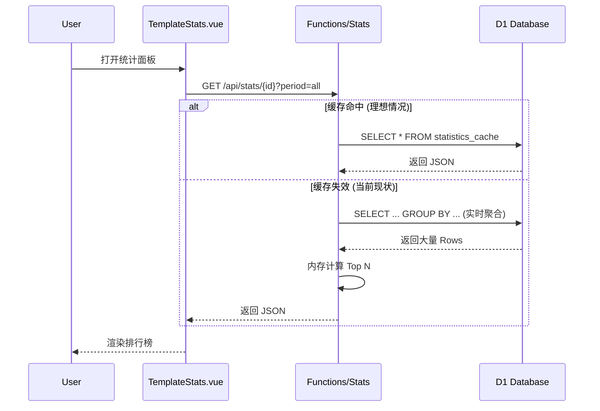

# 🗺️ Anime Role Grid - 开发者导航 (The Map)

> **给舰长的一句话**: 这里是项目的 "控制台"。看不懂代码时，先看这张地图，确认你要修改的功能属于哪个板块。

---

## 1. 核心业务全景图 (Big Picture)

```mermaid
graph TD
    User[用户 (User/Streamer)]
    
    subgraph Frontend [前端 (Vue 3 + Vite)]
        Router[路由 (Vue Router)]
        Store[状态管理 (Pinia/GridStore)]
        
        subgraph Modes [双模态引擎]
            Normal[普通模式 (GridEditor)]
            Streamer[主播模式 (StreamerDock + Canvas)]
        end
        
        Export[导出引擎 (Canvas/Video)]
    end
    
    subgraph Backend [云端 (Cloudflare)]
        API_Save[API: Save Grid]
        API_Search[API: Bangumi Proxy]
        API_Stats[API: Live Stats]
        
        DB[(D1 Database)]
        KV[Cache (Local/KV)]
        BgmAPI[外部: Bangumi API]
    end

    %% 交互流
    User -->|访问| Router
    Router -->|加载| Store
    Store -->|驱动| Modes
    
    %% 数据流
    Modes -->|搜索角色| API_Search
    API_Search -->|转发| BgmAPI
    
    Modes -->|保存填表| API_Save
    API_Save -->|写入| DB
    
    Modes -->|查看热度| API_Stats
    API_Stats -->|聚合查询| DB
    
    %% 导出流
    Modes -->|生成图片/视频| Export
    Export -->|下载| User
```

---

## 2. 文档索引 (Document Index)

### 🏗 架构与设计 (Architecture)
*   [**Frontend_Architecture.md**](Frontend_Architecture.md): 前端组件拆分、UnoCSS 样式系统。
*   [**Database_Schema.md**](Database_Schema.md): D1 数据库表结构设计。
*   [**Deployment_Guide.md**](Deployment_Guide.md): 如何发布到 Cloudflare Pages。
*   [**Business_Architecture_Analysis.md**](Business_Architecture_Analysis.md): 商业价值与用户增长分析。

### 🎮 核心功能技术主要 (Deep Dives)
*   [**Streamer_Mode_Technical_Reference.md**](Streamer_Mode_Technical_Reference.md): **(必读)** 主播模式、Dock 系统、拖拽与撤销/重做架构。
*   [**Feature_Design_PartyWar_and_Scope.md**](Feature_Design_PartyWar_and_Scope.md): 未来 "党争/PK" 功能的设计草稿。

### ⚙️ API 与接口 (Reference)
*   [**API_Reference.md**](API_Reference.md): 后端接口定义。
*   [**Agent_Guidelines.md**](Agent_Guidelines.md): 给 AI 助手看的操作规范。

---

## 3. 关键数据流向 (Critical Flows)

### 3.1 主播模式：从 "拖拽" 到 "上屏"

```mermaid
sequenceDiagram
    participant User
    participant Dock as StreamerDock (Vue)
    participant Canvas as GridCanvas (Vue)
    participant Store as GridStore (State)
    participant History as UseRefHistory

    User->>Dock: 拖拽角色 (Drag Start)
    Note over Dock: 触发 onDragStart (Group: grid)
    
    User->>Canvas: 放入格子 (Drop)
    Canvas->>Store: updateItem(index, character)
    
    rect rgb(20, 20, 20)
        Note right of Store: 状态变更 (Mutation)
        Store->>Store: savedGrids[id] = newConfig
        Store->>History: 自动捕获快照 (Snapshot)
    end
    
    Store-->>Canvas: 响应式更新 UI
    Store-->>Dock: 响应式更新 (如需)
```


### 3.2 数据统计：从 "查看" 到 "缓存"


---

## 4. 维护者指南 (Mantainence)
*   **如何修改数据库?**: 修改 `schema.sql` -> 运行 `npx wrangler d1 execute ...`
*   **如何调试后端?**: `npm run dev:full` (启动全栈模拟环境)
*   **Token 在哪?**: 不在代码里！去 Cloudflare Dashboard 设置环境变量。
