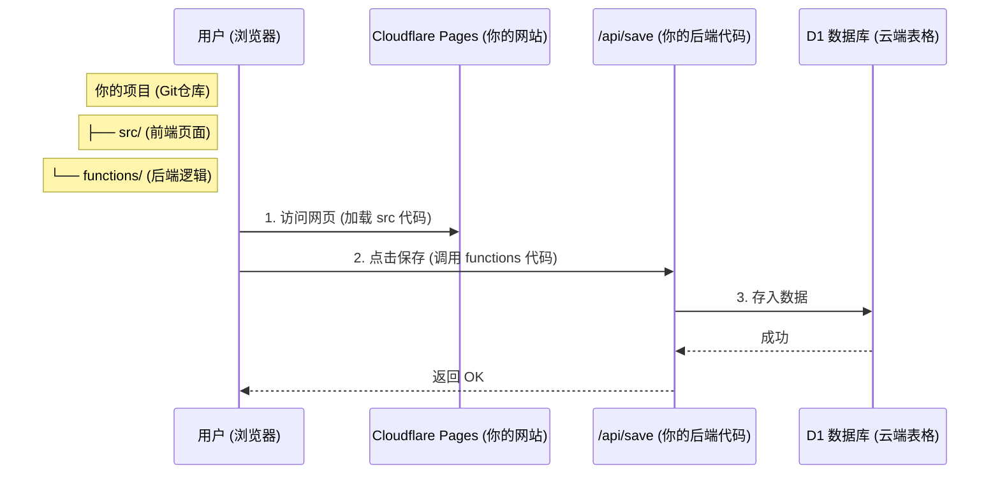

# 数据收集方案：Cloudflare D1 架构详解

## 1. 核心疑惑解答：Page 还是 Worker？

**不用纠结，其实它们是“一家人”。**

你现在用的是 **Cloudflare Pages** 的高级功能，叫做 **Pages Functions**。

*   **以前的玩法**：前端部署在 Pages，后端要去单独开一个 Worker 项目，两个项目分开管理，很麻烦。
*   **现在的玩法 (我们用的)**：**你只需要在 Pages 项目里新建一个 `functions` 文件夹**。
    *   Cloudflare 会自动识别这个“魔法文件夹”。
    *   它会自动把这个文件夹里的代码变成后端 API。
    *   **结果**：你的同一个 Git 仓库，即包含了前端（`src/`），也包含了后端（`functions/`），部署时**一次性全部上线**。

## 2. 核心架构图 (Architecture)

## 3. 数据库设计 (Data Dictionary)

我们采用了 **V2 (Rich Data)** 方案，不仅存储“填了谁”，还存储“填在什么位置（什么含义）”。

### 表 1: `saves` (存档表)
记录每一次用户的“保存”行为。

| 字段名 | 类型 | 说明 | 示例 |
| :--- | :--- | :--- | :--- |
| `id` | TEXT | 唯一标识符 (UUID) | `81ddc605...` |
| `template_id` | TEXT | 使用的模板类型 | `classic` (经典), `couple` (CP) |
| `custom_title` | TEXT | **[V2新增]** 用户自定义标题 | `我的二次元后宫` |
| `created_at` | INT | 创建时间 (秒级时间戳) | `1701234567` |

### 表 2: `save_items` (详情表)
记录格子里的具体内容。这是分析的核心。

| 字段名 | 类型 | 说明 | 示例 |
| :--- | :--- | :--- | :--- |
| `id` | INT | 自增 ID | `1`, `2`... |
| `save_id` | TEXT | 关联到哪次存档 | `81ddc605...` |
| `slot_index` | INT | 格子位置 (0, 1, 2...) | `0` |
| `slot_label` | TEXT | **[V2新增]** 格子含义 (核心语义) | `本命`, `想做朋友`, `甚至想结婚` |
| `character_name` | TEXT | 角色名字 | `有马加奈` |
| `img_url` | TEXT | **[V2新增]** 角色图片链接 | `https://lain.bgm.tv/...jpg` |

## 4. 未来数据处理指南 (Analytics Roadmap)

当你收集了 10,000 条数据后，你可以做非常酷的事情。

### 第一阶段：基础统计 (SQL 直接出图)
*不需要写代码，直接在 Cloudflare 后台跑 SQL。*
*   **全网老婆榜**：`SELECT character_name FROM save_items WHERE slot_label='本命' ...`
*   **热门 CP 榜**：统计在同一个 `save_id` 里同时出现的两个角色。

### 第二阶段：数据导出 (Export)
如果你想用 Excel 或 Python 分析：
1.  **导出 JSON**: `npx wrangler d1 execute anime-grid-db --remote --command="SELECT * FROM save_items" --json > data.json`
2.  **转 CSV**: 用网上的 JSON-to-CSV 工具转换一下。

### 第三阶段：高级可视化 (Python/Echarts)
*   **词云图 (Word Cloud)**：用 `slot_label='本命'` 的名字生成词云。
*   **关系网络 (Network Graph)**：经常一起出现的角色连线，生成“二次元关系网”。
*   **照片墙 (Photo Wall)**：利用 `img_url`，生成一张由 1000 个“本命”头像拼成的大图。

---
**数据隐私声明**：
我们在设计表结构时，**刻意不存储** IP 地址 (`user_ip`) 和浏览器指纹。这意味着数据是**完全匿名**的，符合 GDPR 等隐私法规，你可以放心地公开展示统计结果。
