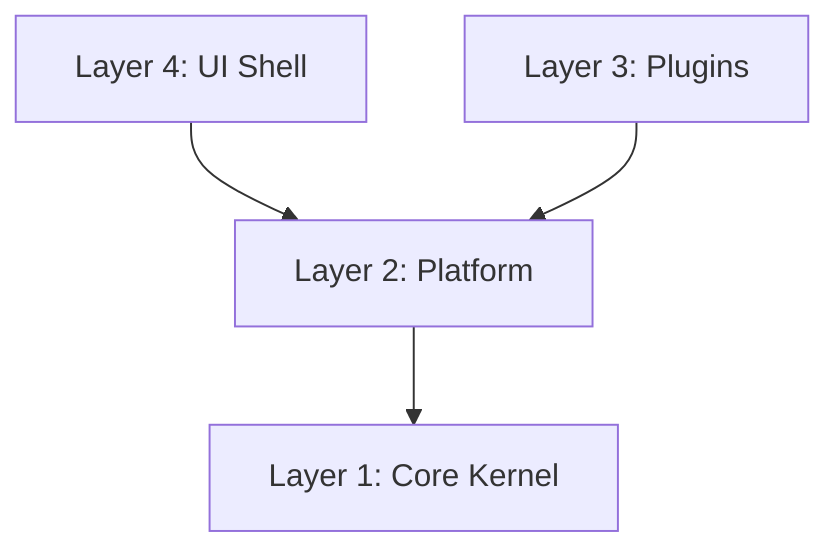

# V3 Project Structure Guide (目录结构说明)

> [!NOTE]
> 本文档详细说明了 AnimeGrid V3 引擎的微内核架构与文件组织方式。
> 任何新增代码都必须严格遵守此分层原则。

## 1. 核心架构分层 (The 4 Layers)

V3 引擎采用了类似 **VS Code** 的架构，分为四个清晰的层级：



### Layer 1: Core Kernel (`src/v3/core`)
**"引擎心脏"**
- **只能被 Platform 引用**，严禁 UI 直接访问。
- 定义了最基础的数据结构 (ECS Registry)、组件 (Component) 和系统接口。
- **关键文件**:
    - `ecs/registry.ts`: 响应式 ECS 数据库。
    - `ecs/types.ts`: 核心组件定义 (Layout, Visual, Meta)。

### Layer 2: Platform (`src/v3/platform`)
**"操作系统"**
- **承上启下**。负责加载插件，管理全局单例服务。
- **关键文件**:
    - `loader.ts`: 全局单例入口 (`getEcsRegistry()`).
    - `api/IPlugin.ts`: 插件必须实现的接口协议。
    - `services/PresetService.ts`: 模板预设管理。
    - `services/OverlayManager.ts`: 全局弹窗管理。

### Layer 3: Plugins (`src/v3/plugins`)
**"应用生态" (最重要的部分)**
- **业务逻辑的唯一归宿**。
- 每个玩法（如：标准格子、Pyramid、TierList）都必须是一个**独立的插件包**。
- **插件包结构规范**:
  ```
  src/v3/plugins/
  └── <plugin-id>/              <-- 独立文件夹 (例如 grid-standard)
      ├── index.ts              (插件入口，实现 IPlugin)
      ├── StandardGridView.vue  (主视图)
      ├── StandardGridSystem.ts (逻辑系统)
      ├── components/           (该插件专用的 UI 组件)
      └── overlays/             (该插件专用的弹窗)
  ```

### Layer 4: UI Shell (`src/v3/ui`)
**"界面外壳"**
- **只负责容器**。就像浏览器的窗口框架。
- 负责 Workbench 布局、侧边栏、顶栏。
- **关键文件**:
    - `workbench/layouts/NormalLayout.vue`: 普通模式的布局容器。
    - `viewport/MainViewport.vue`: 渲染插件视图的画布区域。

---

## 2. 详细目录树 (Detailed File Tree)

以下是重构后的标准目录结构：

```text
src/v3/
├── core/                       <-- [L1] 内核
│   ├── ecs/                    (ECS 核心实现)
│   ├── schema/                 (数据校验 Zod)
│   └── types/                  (全局类型定义)
│
├── platform/                   <-- [L2] 平台
│   ├── api/                    (插件 API 定义)
│   ├── services/               (全局服务)
│   │   ├── OverlayManager.ts   (弹窗服务)
│   │   └── PresetService.ts    (模板服务)
│   ├── loader.ts               (引擎启动器)
│   └── workbench/              (工作台状态)
│
├── plugins/                    <-- [L3] 插件 (业务逻辑)
│   └── grid-standard/          <-- [标准格子插件] (自包含)
│       ├── index.ts            (入口: 注册 View 和 System)
│       ├── StandardGridView.vue (视图: 显示格子)
│       └── StandardGridSystem.ts (系统: 生成/管理格子)
│
└── ui/                         <-- [L4] 界面
    ├── viewport/               (画布容器)
    ├── workbench/              (工作台布局)
    │   ├── layouts/
    │   │   └── NormalLayout.vue (主界面)
    │   └── components/         (通用 UI 组件: Header, Footer)
    └── overlays/               (通用弹窗宿主: Gallery, Search)
```

## 3. 开发指引 (How to Dev)

### Q: 我想修改 "格子" 的生成逻辑？
A: 去 `src/v3/plugins/grid-standard/StandardGridSystem.ts`。

### Q: 我想修改顶部标题栏的样式？
A: 去 `src/v3/plugins/grid-standard/components/V1Header.vue`。

### Q: 我想加一个新的功能弹窗？
1. 在 `src/v3/plugins/grid-standard/overlays/` 下创建 `.vue`。
2. 在 `StandardGridView.vue` 或 `Toolbar` 中引用并调用 `overlays.open()`。

### Q: 为什么 `NormalLayout.vue` 里要引用插件的组件？
A: 理想情况下不应该。但目前为了完美复刻 V1 的布局，我们在 `NormalLayout` 中硬编码了 `V1Header` 等组件。在未来 Phase 5+ 插件化更彻底时，这些应该变成 `activePlugin.headerComponent` 的动态渲染。目前是**过渡期方案**。
