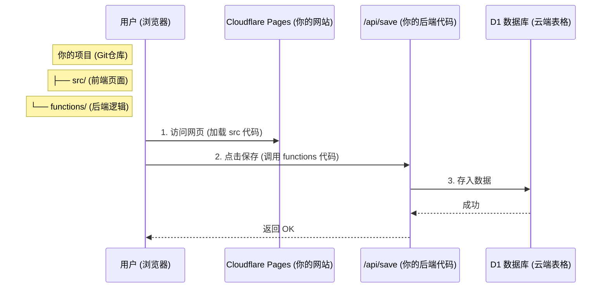

# 数据收集方案：Cloudflare D1 架构详解

## 1. 核心疑惑解答：Page 还是 Worker？

**不用纠结，其实它们是“一家人”。**

你现在用的是 **Cloudflare Pages** 的高级功能，叫做 **Pages Functions**。

*   **以前的玩法**：前端部署在 Pages，后端要去单独开一个 Worker 项目，两个项目分开管理，很麻烦。
*   **现在的玩法 (我们用的)**：**你只需要在 Pages 项目里新建一个 `functions` 文件夹**。
    *   Cloudflare 会自动识别这个“魔法文件夹”。
    *   它会自动把这个文件夹里的代码变成后端 API。
    *   **结果**：你的同一个 Git 仓库，即包含了前端（`src/`），也包含了后端（`functions/`），部署时**一次性全部上线**。

所以，虽然本质上它运行起来像 Worker，但对你来说，**它就是你项目里的一部分**，不需要你单独去维护另一个 Worker 项目。

## 2. 核心架构图 (Architecture)

## 3. 为什么这样最方便？

1.  **零配置**：你不需要去 Cloudflare 后台新建一个 "Worker App"，你只需要把代码推送到现在的仓库，Pages 自动就拥有了后端能力。
2.  **同源**：没有跨域问题 (CORS)，因为前端和后端都在同一个域名下。
3.  **免费**：Pages Functions 的额度是和 Workers 共享的，免费版完全够用。

## 4. 你现在需要做什么？

因为代码（前端 fetch 和 后端 functions）我都已经写进你的文件里了。

**你只需要做这两件事：**

1.  **提交代码到 GitHub**：
    Cloudflare 看到你有了 `functions` 文件夹，自动就会开始构建后端。
2.  **去后台点一下“绑定数据库”**：
    因为出于安全原因，Cloudflare 不允许代码随便访问数据库，必须你在后台手动“连线”一下（绑定变量 `DB`）。

就这么简单！
